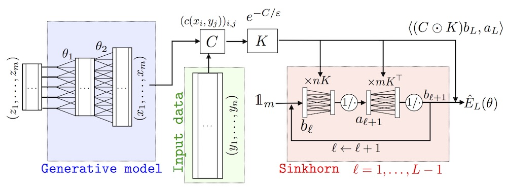

SinkhornAutoDiff - Python toolbox to integrate optimal transport loss functions using automatic differentiation and Sinkhorn's algorithm
------

Overview
------

Python toolbox to compute and differentiate Optimal Transport (OT) distances. It computes the cost using (generalization of) Sinkhorn's algorithm [1], which can in turn be applied:
- To optimize barycenters and their weights [2].
- To perform shape registration [9].
- As a loss between machine learning features [1].
- To perform density fitting for generative model [8] (see also image bellow).

Organization
------

- code/ contains the core routine to compute OT losses and their differentials.
- notebooks/ contains a collection of [Jupyter notebooks](http://jupyter.org/) that showcase simple usage of the toolbox.

Planed Features
------

- Classical Sinkhorn using matrix/vector multiplications [1].
- Acceleration for separable kernels (e.g. Gaussian kernels for images) [5].
- Log-domain stabilized Sinkhorn [7].
- Unbalanced transport (for several f-divergence fidelity) [7].
- Heavy-ball acceleration [10].
- Barycenters [7].
- Gromov-Wasserstein [4].
- Dictionary learning [3].
- Dynamic time warping [6].

Installation
------

Current implementations are available using the following automatic-differentiation toolboxes:
- [Theano](http://deeplearning.net/software/theano/)
- [TensorFlow](https://www.tensorflow.org/)
- [Chainer](https://chainer.org/)

References:
------

[1] Marco Cuturi,  Sinkhorn Distances: Lightspeed Computation of Optimal Transport, NIPS 2013

[2] N. Bonneel, G. Peyré, M. Cuturi. Wasserstein Barycentric Coordinates: Histogram Regression Using Optimal Transport. ACM Transactions on Graphics (Proc. SIGGRAPH 2016), 35(4), pp. 71:1–71:10, 2016.

[3] A. Rolet, M. Cuturi, G. Peyré. Fast Dictionary Learning with a Smoothed Wasserstein Loss. In Proc. AISTATS'16, pp. 630–638, 2016.

[4] G. Peyré, M. Cuturi, J. Solomon. Gromov-Wasserstein Averaging of Kernel and Distance Matrices. In Proc. ICML'16, pp. 2664–2672, 2016.

[5] J. Solomon, F. de Goes, G. Peyré, M. Cuturi, A. Butscher, A. Nguyen, T. Du, L. Guibas. Convolutional Wasserstein Distances: Efficient Optimal Transportation on Geometric Domains. ACM Transactions on Graphics (Proc. SIGGRAPH 2015), 34(4), pp. 66:1–66:11, 2015.

[6] M. Cuturi, M. Blondel, Soft-DTW: A Differentiable Loss Function for Time Series, ICML 2017.

[7] L. Chizat, G. Peyré, B. Schmitzer, F-X. Vialard. Scaling Algorithms for Unbalanced Transport Problems. Preprint Arxiv:1607.05816, 2016.

[8] Sinkhorn-AutoDiff: Tractable Wasserstein Learning of Generative Models, Aude Genevay, Gabriel Peyré, Marco Cuturi, Arxiv, 2017

[9] Optimal Transport for Diffeomorphic Registration, Jean Feydy, Benjamin Charlier, Francois-Xavier Vialard, Gabriel Peyré, MICCAI 2017.

[10] G. Peyré, L. Chizat, F-X. Vialard, J. Solomon. Quantum Optimal Transport for Tensor Field Processing. Preprint Arxiv:1612.08731, 2016.

Authors
------

- Gwendoline de Bie (ENS)
- [Marco Cuturi](http://marcocuturi.net/) (ENSAE)
- [Jean Feydy](http://www.math.ens.fr/~feydy/) (ENS)
- [Aude Genevay](https://audeg.github.io/) (ENS)
- [Gabriel Peyré](http://www.gpeyre.com/) (CNRS and ENS)
- [Morgan Schmitz](http://www.cosmostat.org/people/mschmitz/) (CEA)
- [Francois-Xavier Vialard](https://www.ceremade.dauphine.fr/~vialard/) (Paris-Dauphine)
- ...

Links
------

- [Python Optimal Transport library](https://github.com/rflamary/POT)
- [Mathematical coffees: Optimal Transport Meets Machine Learning](https://mathematical-coffees.github.io/mc01-ot/)

Copyright (c) 2017 Noria's team
